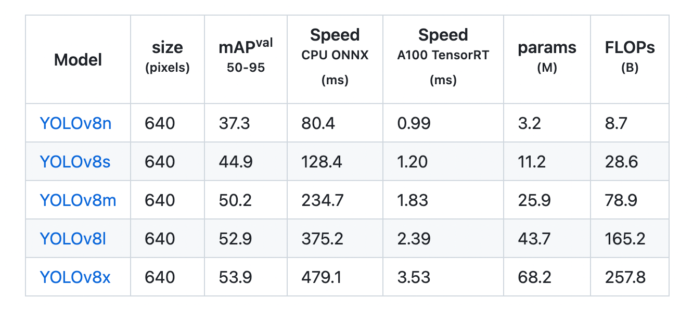

<h1 align="center">Hi 👋, this is object detection project</h1>
<h3 align="center">Safety Object Detection</h3>

  

- 🔭 We learned datas science in **LeWagon**

- 📫 Reference **Roboflow**

- 📄 Model : **YOLOv8 trained to detect 10 object classes.**
- 📄 Optimizers : **Adamax/RMSProp/AdamW/SGD/Adam**

  

  

  This is a comparison of the YOLOv8 model.

  

  Size, Speed, and Accuracy comparison of the five models of Yolov8. (Image Source: Ultralytics)

<h3 align="left">Languages and Tools:</h3>

             

